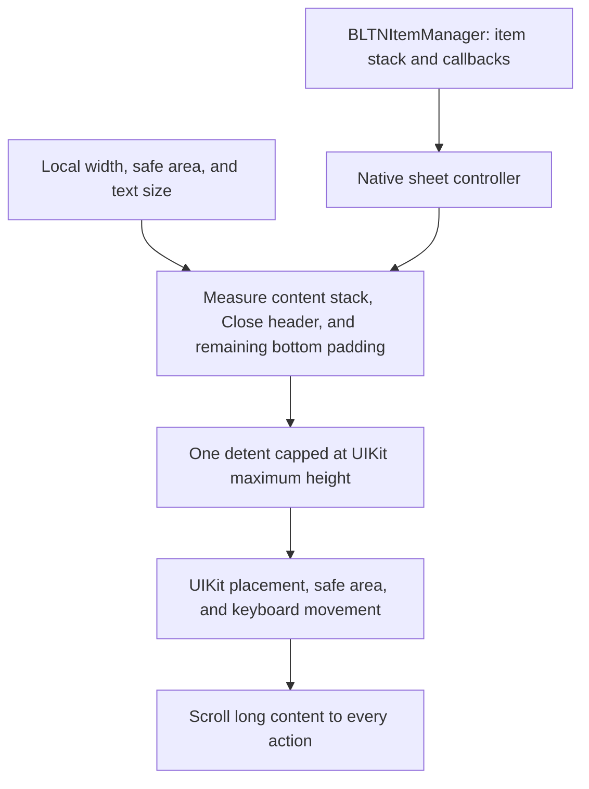
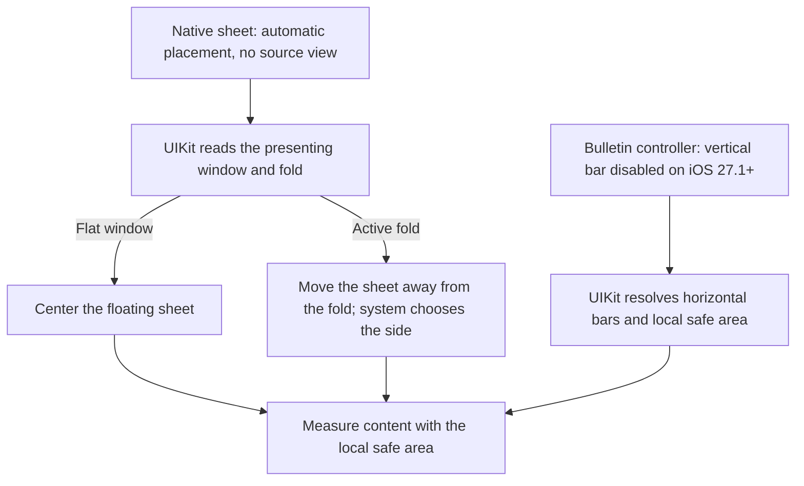

# Adaptive layout

BulletinBoard uses native UIKit sheets on iOS 17 and later. It measures item content from the current view bounds and safe area. UIKit controls placement, keyboard movement, and system gestures. There is no custom presenter or separate overlay window.

## Content height and scrolling

Each sheet has one content-height detent. It has no second full-height stop. Before presentation, the controller measures content from the presenter's local usable width. After presentation, it measures again at the sheet's actual width and caps the detent at UIKit's maximum height. Long content uses one scroll view. Width, safe-area, and Dynamic Type changes trigger a new measurement. UIKit can adjust the sheet for the keyboard.

Content without a Close header has a 32-point top gap. The content keeps at least 32 points of total bottom clearance to match that gap in a floating sheet. The local safe area provides the bottom space first. Extra padding is only the amount needed to reach 32 points. A 34-point safe area adds no padding; a 6-point safe area adds 26 points; no bottom inset adds 32 points. The remaining padding updates during layout when the safe area changes.

| Bottom safe-area inset | Extra padding | Total clearance |
| --- | --- | --- |
| 0 pt | 32 pt | 32 pt |
| 6 pt | 26 pt | 32 pt |
| 32 pt | 0 pt | 32 pt |
| 34 pt | 0 pt | 34 pt |

The scroll view extends to the bottom sheet edge and lets UIKit adjust its content insets. Its horizontal frame stays inside the local safe area; the content adds 24-point design margins on each side. The scroll view's own horizontal safe-area insets are zero inside that frame, so `.always` does not apply the side insets twice. The background fills the entire sheet. The custom detent excludes the bottom safe area; UIKit adds that area when the sheet is edge-attached. Only the remaining design padding enters the content-height calculation. A frame pinned to the bottom safe-area guide gives the same final-control position. See [Apple's custom-detent contract](https://developer.apple.com/documentation/uikit/uisheetpresentationcontroller/detent/custom(identifier:resolver:)).

The scroll viewport starts below the fixed Close header. UIKit's navigation-bar Close item supplies the symbol, accessibility label, pressed state, and system appearance. The header follows the system background and layout direction. Empty header space passes touches through. Hiding Close removes its header space.

On iOS 26.1 and later, `UIColorEffect` replaces the sheet's glass with a solid `.systemBackground` surface. The content uses `.systemBackground` on every supported release. On iOS 26.0, UIKit can retain glass around that content. The grabber stays hidden because there is only one height stop.

## Page transitions and loading

A page change preserves a snapshot before the old item releases its views. The snapshot fades out over 0.15 seconds. The new views stay hidden but remain measurable. The controller then invalidates the content detent inside `UISheetPresentationController.animateChanges` and fades the new content in over 0.25 seconds. UIKit owns the sheet resize curve and duration.

```mermaid
stateDiagram-v2
    [*] --> Visible
    Visible --> FadeOut: Push or pop; block input and dismissal
    FadeOut --> Resize: Remove snapshot; measure new content
    Resize --> FadeIn: Animate detent; call willDisplay
    FadeIn --> Visible: Restore input; call onDisplay
    FadeOut --> FadeOut: New page cancels old transition
    FadeOut --> Loading: Loading cancels fade
    FadeIn --> Loading: Loading cancels fade
    Loading --> Visible: Hide loading; reuse current views
    Visible --> Dismissed: Dismiss
    FadeOut --> Dismissed: Cancel before teardown
    FadeIn --> Dismissed: Cancel before teardown
```

`willDisplay()` runs before content fades in; `onDisplay()` runs after its fade completes. These callbacks do not indicate the end of UIKit's separate resize animation. Generation checks stop old callbacks after a new page or dismissal. Reduce Motion and disabled UIView animations apply the page and callbacks immediately.

Loading retains the current sheet height and blocks interactive dismissal. It cancels an active content fade, removes its snapshot, and shows the spinner at once. Hiding loading reuses the current views and values. It completes pending page callbacks once and does not repeat callbacks for a page that already finished display.

## Migration and options

The custom presenter has been removed. These properties remain for source compatibility, are deprecated, and have no effect:

| Setting | Current behavior |
| --- | --- |
| `presentationStyle` (including `.custom`) | Always uses a native sheet. |
| `backgroundColor`, `backgroundViewStyle` | UIKit and the system background control the surface. |
| `edgeSpacing`, `cardCornerRadius` | UIKit controls margins and corners. |
| `BLTNItem.shouldRespondToKeyboardChanges` | UIKit controls keyboard movement. |

The enum cases and raw values remain unchanged so existing switches still compile. Public `AnimationChain` and `AnimationPhase` utilities also remain available.

`allowsSwipeInteraction = false` blocks UIKit interactive dismissal, including outside taps. Explicit actions and Close can still dismiss an item that permits dismissal. Status-bar and home-indicator settings remain available, but their effect follows UIKit's page-sheet presentation rules. Home-indicator auto-hide is enabled by default. Set `hidesHomeIndicator = false` before presentation to request a visible indicator. UIKit controls its actual visibility; safe-area clearance stays in place. `withContentView` still exposes the content container; it has no custom rounded-card layer.

`showBulletin(in: windowScene)` presents from an existing visible controller in that scene. Use `showBulletin(above:)` for a specific presenter.

## iPhone Duo and demo checks

The sheet keeps UIKit's automatic placement and leaves `sourceView` unset. A floating sheet centers in a flat window. UIKit moves native sheets away from an active fold and chooses the side; the framework does not force a left or right edge. See [Apple's Duo sheet guidance](https://developer.apple.com/videos/play/tech-talks/111466/) and [the source-view placement contract](https://developer.apple.com/documentation/uikit/uisheetpresentationcontroller/sourceview). A tall native sheet can span a horizontal fold. A short viewport test proves scrolling and action reachability, but it does not simulate a physical fold.

On iOS 27.1 and later, the bulletin controller returns `.disabled` from `preferredVerticalBarBehavior`. Bulletins have at most one bar control, Close, so a horizontal layout avoids reserving a side bar for that control. UIKit removes the vertical bar's side inset and restores horizontal bar and status-bar behavior. Keep this preference fixed during page changes, loading, and changes to Close visibility. Older releases keep their native sheet behavior; the minimum remains iOS 17. See [Apple's guidance for sheets with one bar control](https://developer.apple.com/videos/play/tech-talks/111462/?time=861).

The preference belongs to the presented bulletin controller. The presenting controller keeps its own preference. UIKit can reflow the sheet and reposition the status bar during presentation. Text, Close, and actions still use the resulting local safe area, including any camera or other obstruction. The framework does not ignore side insets or subtract a presumed bar width.

Give custom item content flexible horizontal constraints and a complete vertical layout. Collections must invalidate width-dependent cell sizes when their bounds change. Both demo galleries recalculate cells after width changes. The nine-photo grid uses the outer scroll view so its rows and actions share one scroll path.

Use the demo's **Bulletins** menu and the framework's **Page Size Transitions** preview:

1. Push a longer page, then return with Back. Check smooth growth, shrinkage, and content fading.
2. Repeat with Reduce Motion enabled. The new page must appear directly.
3. Open Enter Name, show the keyboard, and resize without losing the field value.
4. Start loading, change the current page, and open an alert above the sheet. Loading must block interactive dismissal; closing the alert must retain the bulletin.
5. Scroll Pet Care Guide and Pet Photos to their final actions. Resize each gallery.
6. Check light and dark mode over a busy background. Check Close in right-to-left layout.
7. On a working Duo runtime, check centered placement when flat, then fold and unfold with the sheet open. Check the vertical Book fold and horizontal partial fold in both orientations. On the outer display, check horizontal bars and the reclaimed side space, with and without Close. Verify that the sheet avoids the fold and keeps edited values. Check matching top and bottom gaps in a floating sheet without a Close header. Scroll through tall content and reach every action.
8. Dismiss and reopen. Repeat on an older supported runtime.

See [Framework previews](Framework%20Previews.md) and [Testing](../Tests/TESTING.md).

## Apple references

- [UISheetPresentationController](https://developer.apple.com/documentation/uikit/uisheetpresentationcontroller)
- [Animate custom detent changes](https://developer.apple.com/documentation/uikit/uisheetpresentationcontroller/invalidatedetents())
- [Native sheet placement](https://developer.apple.com/documentation/uikit/uisheetpresentationcontroller/preferredplacement)
- [Design for iPhone Duo](https://developer.apple.com/videos/play/tech-talks/111466/)
