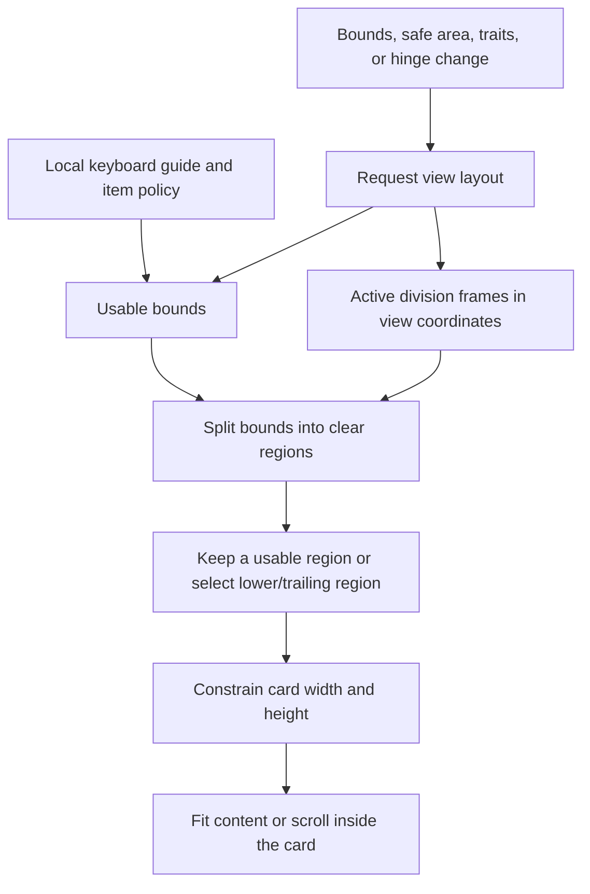

# Adaptive layout

BulletinBoard uses the presented view's bounds, traits, safe area, and keyboard layout guide. It does not use a global screen size or device orientation to place the card.

Build with Xcode 27.1 or later. The library still runs on iOS 15 and later. Hinge and reserved-region calls run only on iOS 27.1 and later.

## Placement

The card stays in one clear region. A vertical division selects the trailing region, with support for right-to-left layout. A horizontal division selects the lower region. The selected region stays in use while it has enough space. If the keyboard leaves only a small strip in that region, the card can use another clear region.

The division frames already include system interaction margins. BulletinBoard does not add those margins again. Hinge updates invalidate layout; each layout reads the current reserved regions. A region change cancels an active swipe before the card moves, so an old dismissal snapshot cannot cover the new region.

Regular-width cards prefer 444 points and shrink when the clear region is narrower. Compact-width cards fill the region with `edgeSpacing`. Card height is limited to the region. The inner scroll view keeps long content and actions reachable without reducing the content's natural height.

## Keyboard and options

`shouldRespondToKeyboardChanges` is read from the current item on each layout. The keyboard guide uses the presented view's coordinates, including keyboard movement and undocked keyboards. It stays connected while the keyboard is hidden, so the first appearance triggers a layout update. A field that has focus is brought into view when the available region changes. A person can still scroll the other content.

`edgeSpacing` is measured from the usable region. Safe-area changes do not set the spacing to zero. The default `cardCornerRadius` is 12; an explicit value is preserved. `edgeSpacing = .none` gives the card square corners. `hidesHomeIndicator` lets the card surface extend to the bottom edge in compact width while the scroll view keeps content clear of the system inset.

On a compact card, a downward drag at the top of the content can dismiss a dismissable item. Other content drags scroll. Nested galleries keep their own scroll gestures.

## Custom items and demo checks

Give custom content flexible horizontal constraints and a complete vertical layout. A collection view must invalidate width-dependent cell sizes when its bounds change. Avoid a fixed control width that exceeds a narrow card.

The demo includes direct entry points for forms, a date picker, pet choices, and long content. Both galleries recalculate cells after width changes. The nine-photo grid uses a square frame and the card's scroll view, so every row and the actions share one scroll path. Isolated UIKit previews show narrow and short layouts.

Check these paths in the iPhone Duo simulator:

1. Open a bulletin fully open, then partially fold it with a vertical division.
2. Rotate to a horizontal division. Check that the whole card stays clear of the fold.
3. Open **Enter Name**, show the keyboard, and fold or unfold without losing the field.
4. Open **Pet Care Guide** and scroll to the final action.
5. Open **Favorite Pets**, continue to the gallery, and change the window width.
6. Dismiss and reopen. Repeat with a compact iPhone and an older supported iOS runtime.

Focused regression tests are described in [Testing](../Tests/TESTING.md).

## Apple references

- [UIView reserved regions](https://developer.apple.com/documentation/uikit/uiview/reservedregions(kind:options:))
- [UIHingeInteraction](https://developer.apple.com/documentation/uikit/uihingeinteraction)
- [Strike a pose with adaptive layouts on iPhone Duo](https://developer.apple.com/videos/play/tech-talks/111463/)
- [Design for iPhone Duo](https://developer.apple.com/videos/play/tech-talks/111466/)
