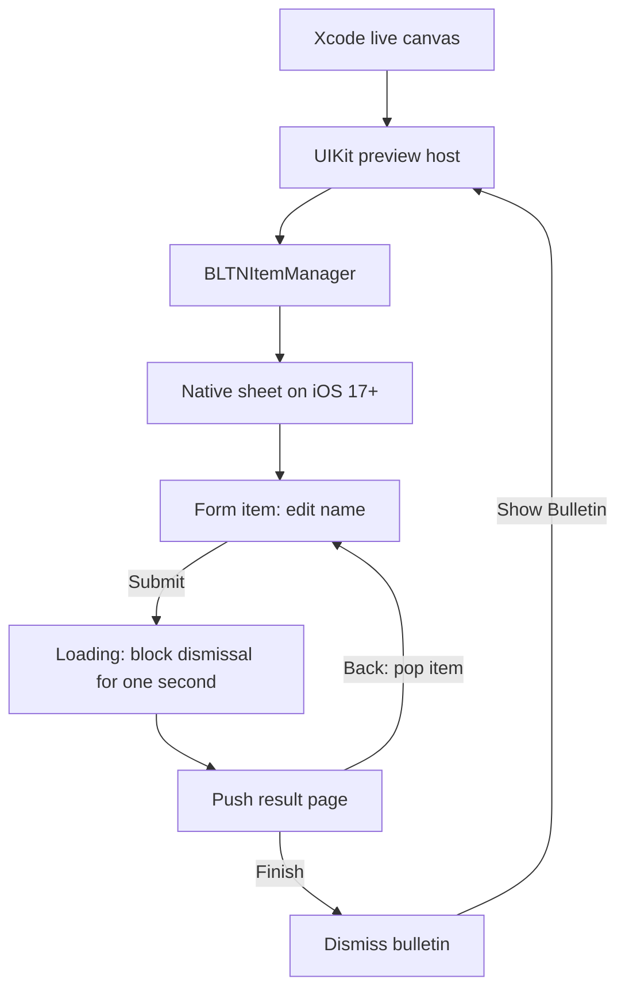

# Framework previews

Open `Sources/Previews/FrameworkBulletinPreviews.swift` in Xcode. Select the `BLTNBoard` scheme from the Swift package or framework project, choose an available iOS simulator, and show the canvas. Use Live mode for buttons, text entry, scrolling, and sheet gestures. General cases inherit the canvas appearance and text-size settings; dedicated dark and large-text cases set those traits explicitly. Xcode can preview a UIKit view controller directly; these previews do not need `BB-Swift` or `CustomBulletins`.

All previews use native sheets and require iOS 17 or later. Use an installed runtime, such as iOS 27.2 on iPhone 18 Pro. Duo fold checks need a working runtime that supports that device. A fixed preview size checks small viewports; it does not simulate a physical fold.

## Cases

| Preview | Check |
| --- | --- |
| Page Size Transitions | Show Longer Page, scroll to Back, return, and repeat. Check sheet growth, shrinkage, and content fading. Repeat with Reduce Motion. |
| Actions | Open Alert, Return, Dismiss, and Show Bulletin. |
| Form and Loading | Edit Name, Submit, wait one second, Back, check the saved name, Submit, then Finish. |
| Long Content - Short | Scroll to Done. Dismiss and reopen. |
| Large Text | Check wrapping and reach the final action at an accessibility text size. |
| Right to Left | Check control placement and the text field in a narrow viewport. |
| Form - Dark | Check text, field, and loading contrast over the colored background. |

The host opens a bulletin once after it appears. After dismissal, **Show Bulletin** creates a new manager and starts a new flow. The host label reports the last presentation or dismissal callback. Form state stays with its item when the manager pushes and pops pages. Loading hides the current content for one second, then pushes a result page. Resetting the preview releases the host and cancels its loading task.

All preview support code is internal and enclosed in `#if DEBUG`. Release builds exclude it. The fixture uses the real manager and local sample data. It applies explicit preview traits to the presented controller because UIKit can present from an ancestor outside the host's trait scope. Initial presentation has no animation so render snapshots show the settled sheet. Changes to production presentation, sizing, callbacks, and loading are visible in the canvas.
